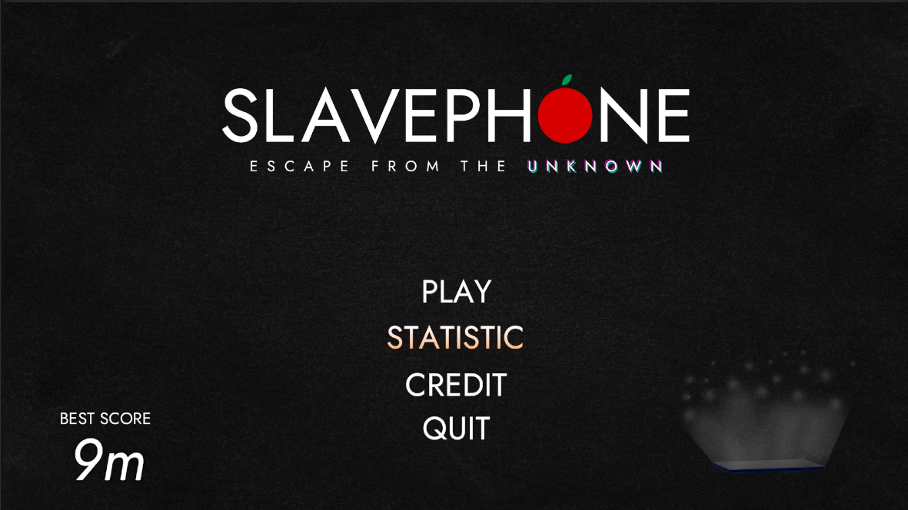
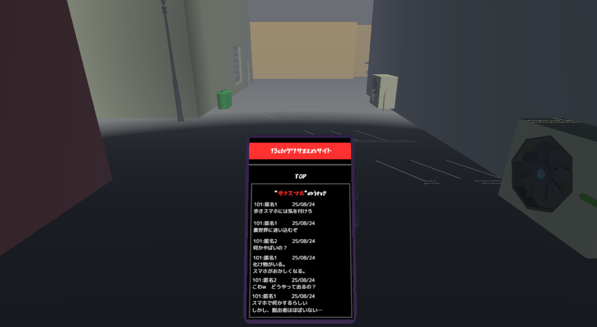
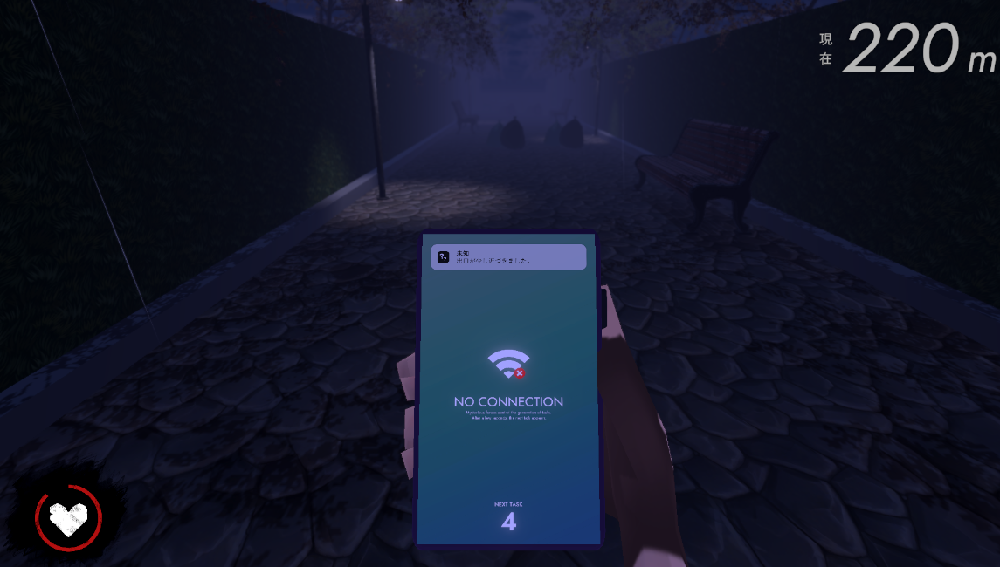

# SLAVEPHONE

## 概要

本作は、Unity と C# を用いて開発した、**歩きスマホをテーマにしたランゲーム**です。
プレイヤーはキャラクターを操作しながら障害物を避けつつ、「スマホ操作」と「安全な移動」の両立を求められます。

---

## コンセプト

本作のコアは以下のジレンマにあります：

> **「スマホを見ると危険、見ないと進めない」**

プレイヤーは注意力を分散させながら行動する必要があり、
**歩きスマホの危険性をゲーム体験として再現**しています。

---

## 背景

大学の夏季プログラムにて、以下のテーマで開発を行いました：

- 「歩きスマホ禁止 × ランゲーム」

プログラミング初心者を中心とした6人チームで、約1ヶ月半かけて制作しました。

---

## 技術スタック

- 言語：C#
- エンジン：Unity
- 開発環境：Visual Studio / VSCode

---

## プロジェクト構成

- `.vscode`, `.vsconfig`：開発環境設定
- `Assets`：ゲームアセット
- `Packages`：依存パッケージ
- `ProjectSettings`：プロジェクト設定

---

## セットアップ

### 1. リポジトリをクローン

```bash
git clone https://github.com/fuji-byte/teamD.git
cd teamD
```

### 2. Unityで開く

- Unity Hubを起動
- 「プロジェクトを追加」から本フォルダを選択
- 対応バージョンで起動

---

## ゲーム内容

### ■ 基本ルール

- キャラクターは自動で前進
- 障害物を回避しながら進む
- 衝突するとHPが減少

---

### ■ HP（体力）

- 初期HPは100
- 障害物に当たると減少
- 0になるとゲームオーバー
- 被ダメージ時は画面エフェクトで状態を表現

---

### ■ スマホタスク（ミニゲーム）

プレイ中にスマホ画面が表示され、ミニゲームが発生します。

#### 例

- フラッピーバード風ゲーム
  - 左クリックでジャンプ
  - 障害物を回避

#### 結果

- 成功 → ゲーム進行（ゴールに近づく）
- 失敗 → HPが50減少

---

### ■ 障害物

#### 固定障害物

- マンホール
- ゴミ袋
- ゴミ箱
- 瓦礫
- 看板 など

#### 移動障害物

- 鉄球

---

### ■ ゲームの流れ

1. 自動で前進開始
2. 障害物を回避
3. スマホタスク発生
4. 成功でゴールに近づく
5. HP0でゲームオーバー、またはゴール到達でクリア

---

## ゲーム画面

### タイトル画面



### ストーリー導入



### プレイ画面



---

## 工夫した点

- ランゲームとミニゲームの同時進行による**注意力分散の再現**
- 「見る／見ない」の判断をプレイヤーに委ねるゲーム設計
- 不気味な雰囲気を演出するビジュアル設計

---

## 苦労した点

- 初心者チームでの役割分担と進行管理
- チーム開発におけるGitHub運用
- 「歩きスマホの危険性」をゲームとして成立させる設計

---

## 今後の改善

### ビジュアル

- リザルト画面の改善
- カウントダウン演出の調整
- OPムービーによる世界観補強

### エンジニアリング

- スマホタスクに追加要素を導入しゲーム性を強化
- 障害物生成のランダム性を制御し、ゲームバランスを調整

---

## まとめ

本作は、単なるランゲームではなく、
**現実の危険行動をゲーム体験として再構築した作品**です。

プレイヤーに「判断の難しさ」と「注意力の分散」を体感させることを目的としています。

---

## 参考資料

### 企画書（開発途中）

https://docs.google.com/presentation/d/10Ol1OICW68a0u4LgctbLgiKklXplZdf1XbG-z8al0y8/edit?usp=sharing

---

## 旧仕様（参考）

開発初期には以下の仕様が検討されていました：

### HP

- ハート2つ（非表示）

### 不安度ゲージ

- 時間経過で増加
- 最大でゲームオーバー
- スマホタスク成功で減少

※最終版ではシステム簡略化のため削除
